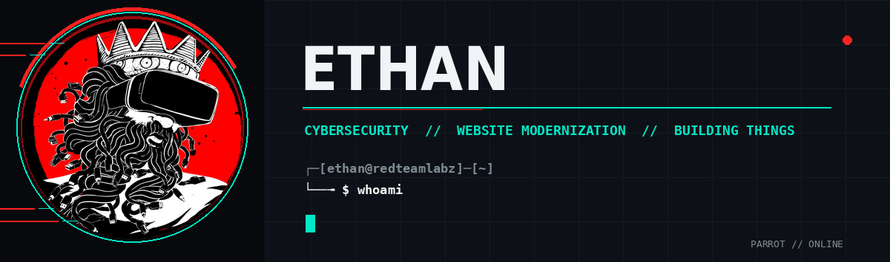
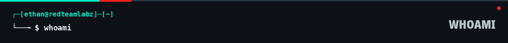
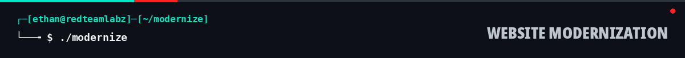
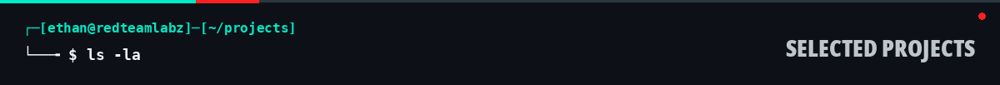
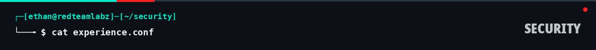
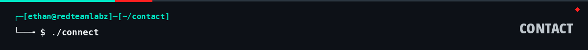
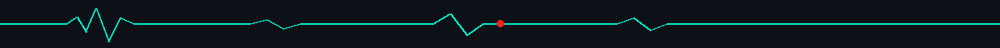

  

&nbsp;&nbsp;

  

**ethan@redteamlabs.dev**

 

Cybersecurity analyst working across **security operations, investigation, threat intelligence, and infrastructure**.

I also build technical projects and modernize websites for businesses that have outgrown their current site.

 

### I modernize outdated business websites.

Cleaner design, better mobile experience, simpler navigation, working links, and a smoother customer experience.

I also handle the infrastructure behind it — **domains, DNS, Cloudflare, deployment, performance, and baseline security.**

**KEEP WHAT WORKS · FIX WHAT DOESN'T · MAKE IT CURRENT**

  

 

### RED TEAM LABS
Interactive cybersecurity education inspired by real-world attacker and defender behavior.  
**[redteamlabs.dev →](https://redteamlabs.dev)**

 

### MALWARE ANALYSIS LAB
Isolated malware-analysis infrastructure for controlled detonation, simulated network services, and repeatable analysis workflows.  
**Proxmox VE · OPNsense · REMnux · INetSim · Windows**

 

### WAZUH + OTX THREAT ENRICHMENT
Local threat-intelligence enrichment combining **Wazuh**, **AlienVault OTX**, and locally hosted AI to add context to alerts and support analyst workflows.  
**Wazuh · AlienVault OTX · Ollama · Open WebUI · Docker · Ubuntu**

 

I work professionally in security operations — investigating suspicious activity, analyzing telemetry, and supporting incident response.

**Detection & Response** — Exabeam · LogRhythm · CrowdStrike · Wazuh

**Investigation & Intelligence** — Windows event telemetry · Endpoint telemetry · Network telemetry · PCAP analysis · AlienVault OTX · IOC analysis · Malicious email analysis · OSINT

**Automation & Infrastructure** — PowerShell · Bash · APIs · Proxmox VE · OPNsense · Windows · Linux

 

### Have a website that needs some attention?

I take on select website modernization projects for businesses and organizations.

 

&nbsp;&nbsp;

  

**Cybersecurity Analyst by day. Builder by nature.**

